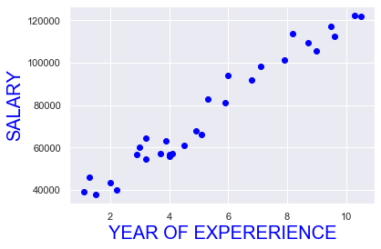
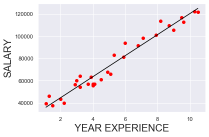

# Simple-Linear-Regression-using-statsmodel
Predicting employee salary based on their experience using linear regression. 

# SIMPLE LINEAR REGRESSION


```python
# Import th relevant libraries
import numpy as np
import pandas as pd
import matplotlib.pyplot as plt
import statsmodels.api as sm
import seaborn as snb
snb.set()
```

### Load the dataset


```python
data=pd.read_csv("Salary_Data.csv")
```


```python
data
```


<div>
<style scoped>
    .dataframe tbody tr th:only-of-type {
        vertical-align: middle;
    }

    .dataframe tbody tr th {
        vertical-align: top;
    }

    .dataframe thead th {
        text-align: right;
    }
</style>
<table border="1" class="dataframe">
  <thead>
    <tr style="text-align: right;">
      <th></th>
      <th>YearsExperience</th>
      <th>Salary</th>
    </tr>
  </thead>
  <tbody>
    <tr>
      <th>0</th>
      <td>1.1</td>
      <td>39343.0</td>
    </tr>
    <tr>
      <th>1</th>
      <td>1.3</td>
      <td>46205.0</td>
    </tr>
    <tr>
      <th>2</th>
      <td>1.5</td>
      <td>37731.0</td>
    </tr>
    <tr>
      <th>3</th>
      <td>2.0</td>
      <td>43525.0</td>
    </tr>
    <tr>
      <th>4</th>
      <td>2.2</td>
      <td>39891.0</td>
    </tr>
    <tr>
      <th>5</th>
      <td>2.9</td>
      <td>56642.0</td>
    </tr>
    <tr>
      <th>6</th>
      <td>3.0</td>
      <td>60150.0</td>
    </tr>
    <tr>
      <th>7</th>
      <td>3.2</td>
      <td>54445.0</td>
    </tr>
    <tr>
      <th>8</th>
      <td>3.2</td>
      <td>64445.0</td>
    </tr>
    <tr>
      <th>9</th>
      <td>3.7</td>
      <td>57189.0</td>
    </tr>
    <tr>
      <th>10</th>
      <td>3.9</td>
      <td>63218.0</td>
    </tr>
    <tr>
      <th>11</th>
      <td>4.0</td>
      <td>55794.0</td>
    </tr>
    <tr>
      <th>12</th>
      <td>4.0</td>
      <td>56957.0</td>
    </tr>
    <tr>
      <th>13</th>
      <td>4.1</td>
      <td>57081.0</td>
    </tr>
    <tr>
      <th>14</th>
      <td>4.5</td>
      <td>61111.0</td>
    </tr>
    <tr>
      <th>15</th>
      <td>4.9</td>
      <td>67938.0</td>
    </tr>
    <tr>
      <th>16</th>
      <td>5.1</td>
      <td>66029.0</td>
    </tr>
    <tr>
      <th>17</th>
      <td>5.3</td>
      <td>83088.0</td>
    </tr>
    <tr>
      <th>18</th>
      <td>5.9</td>
      <td>81363.0</td>
    </tr>
    <tr>
      <th>19</th>
      <td>6.0</td>
      <td>93940.0</td>
    </tr>
    <tr>
      <th>20</th>
      <td>6.8</td>
      <td>91738.0</td>
    </tr>
    <tr>
      <th>21</th>
      <td>7.1</td>
      <td>98273.0</td>
    </tr>
    <tr>
      <th>22</th>
      <td>7.9</td>
      <td>101302.0</td>
    </tr>
    <tr>
      <th>23</th>
      <td>8.2</td>
      <td>113812.0</td>
    </tr>
    <tr>
      <th>24</th>
      <td>8.7</td>
      <td>109431.0</td>
    </tr>
    <tr>
      <th>25</th>
      <td>9.0</td>
      <td>105582.0</td>
    </tr>
    <tr>
      <th>26</th>
      <td>9.5</td>
      <td>116969.0</td>
    </tr>
    <tr>
      <th>27</th>
      <td>9.6</td>
      <td>112635.0</td>
    </tr>
    <tr>
      <th>28</th>
      <td>10.3</td>
      <td>122391.0</td>
    </tr>
    <tr>
      <th>29</th>
      <td>10.5</td>
      <td>121872.0</td>
    </tr>
  </tbody>
</table>
</div>


```python
data.describe()
```


<div>
<style scoped>
    .dataframe tbody tr th:only-of-type {
        vertical-align: middle;
    }

    .dataframe tbody tr th {
        vertical-align: top;
    }

    .dataframe thead th {
        text-align: right;
    }
</style>
<table border="1" class="dataframe">
  <thead>
    <tr style="text-align: right;">
      <th></th>
      <th>YearsExperience</th>
      <th>Salary</th>
    </tr>
  </thead>
  <tbody>
    <tr>
      <th>count</th>
      <td>30.000000</td>
      <td>30.000000</td>
    </tr>
    <tr>
      <th>mean</th>
      <td>5.313333</td>
      <td>76003.000000</td>
    </tr>
    <tr>
      <th>std</th>
      <td>2.837888</td>
      <td>27414.429785</td>
    </tr>
    <tr>
      <th>min</th>
      <td>1.100000</td>
      <td>37731.000000</td>
    </tr>
    <tr>
      <th>25%</th>
      <td>3.200000</td>
      <td>56720.750000</td>
    </tr>
    <tr>
      <th>50%</th>
      <td>4.700000</td>
      <td>65237.000000</td>
    </tr>
    <tr>
      <th>75%</th>
      <td>7.700000</td>
      <td>100544.750000</td>
    </tr>
    <tr>
      <th>max</th>
      <td>10.500000</td>
      <td>122391.000000</td>
    </tr>
  </tbody>
</table>
</div>


### Create regression

### spliting the data into independent variable x and dependent y.


```python
X=data['YearsExperience']
y=data['Salary']
```


```python
X
```


    0      1.1
    1      1.3
    2      1.5
    3      2.0
    4      2.2
    5      2.9
    6      3.0
    7      3.2
    8      3.2
    9      3.7
    10     3.9
    11     4.0
    12     4.0
    13     4.1
    14     4.5
    15     4.9
    16     5.1
    17     5.3
    18     5.9
    19     6.0
    20     6.8
    21     7.1
    22     7.9
    23     8.2
    24     8.7
    25     9.0
    26     9.5
    27     9.6
    28    10.3
    29    10.5
    Name: YearsExperience, dtype: float64


```python
y
```


    0      39343.0
    1      46205.0
    2      37731.0
    3      43525.0
    4      39891.0
    5      56642.0
    6      60150.0
    7      54445.0
    8      64445.0
    9      57189.0
    10     63218.0
    11     55794.0
    12     56957.0
    13     57081.0
    14     61111.0
    15     67938.0
    16     66029.0
    17     83088.0
    18     81363.0
    19     93940.0
    20     91738.0
    21     98273.0
    22    101302.0
    23    113812.0
    24    109431.0
    25    105582.0
    26    116969.0
    27    112635.0
    28    122391.0
    29    121872.0
    Name: Salary, dtype: float64


### Explor the data


```python
plt.scatter(X,y,color="blue")
plt.xlabel("YEAR OF EXPERERIENCE", fontsize=20,color="blue")
plt.ylabel("SALARY",fontsize=20,color="blue")
plt.show()
```





### Creating the regresion with statsmodel


```python
x=sm.add_constant(X)
results=sm.OLS(y,x).fit()
results.summary()
```


<table class="simpletable">
<caption>OLS Regression Results</caption>
<tr>
  <th>Dep. Variable:</th>         <td>Salary</td>      <th>  R-squared:         </th> <td>   0.957</td>
</tr>
<tr>
  <th>Model:</th>                   <td>OLS</td>       <th>  Adj. R-squared:    </th> <td>   0.955</td>
</tr>
<tr>
  <th>Method:</th>             <td>Least Squares</td>  <th>  F-statistic:       </th> <td>   622.5</td>
</tr>
<tr>
  <th>Date:</th>             <td>Thu, 12 Nov 2020</td> <th>  Prob (F-statistic):</th> <td>1.14e-20</td>
</tr>
<tr>
  <th>Time:</th>                 <td>17:21:23</td>     <th>  Log-Likelihood:    </th> <td> -301.44</td>
</tr>
<tr>
  <th>No. Observations:</th>      <td>    30</td>      <th>  AIC:               </th> <td>   606.9</td>
</tr>
<tr>
  <th>Df Residuals:</th>          <td>    28</td>      <th>  BIC:               </th> <td>   609.7</td>
</tr>
<tr>
  <th>Df Model:</th>              <td>     1</td>      <th>                     </th>     <td> </td>   
</tr>
<tr>
  <th>Covariance Type:</th>      <td>nonrobust</td>    <th>                     </th>     <td> </td>   
</tr>
</table>
<table class="simpletable">
<tr>
         <td></td>            <th>coef</th>     <th>std err</th>      <th>t</th>      <th>P>|t|</th>  <th>[0.025</th>    <th>0.975]</th>  
</tr>
<tr>
  <th>const</th>           <td> 2.579e+04</td> <td> 2273.053</td> <td>   11.347</td> <td> 0.000</td> <td> 2.11e+04</td> <td> 3.04e+04</td>
</tr>
<tr>
  <th>YearsExperience</th> <td> 9449.9623</td> <td>  378.755</td> <td>   24.950</td> <td> 0.000</td> <td> 8674.119</td> <td> 1.02e+04</td>
</tr>
</table>
<table class="simpletable">
<tr>
  <th>Omnibus:</th>       <td> 2.140</td> <th>  Durbin-Watson:     </th> <td>   1.648</td>
</tr>
<tr>
  <th>Prob(Omnibus):</th> <td> 0.343</td> <th>  Jarque-Bera (JB):  </th> <td>   1.569</td>
</tr>
<tr>
  <th>Skew:</th>          <td> 0.363</td> <th>  Prob(JB):          </th> <td>   0.456</td>
</tr>
<tr>
  <th>Kurtosis:</th>      <td> 2.147</td> <th>  Cond. No.          </th> <td>    13.2</td>
</tr>
</table><br/><br/>Warnings:<br/>[1] Standard Errors assume that the covariance matrix of the errors is correctly specified.


### plot the regresion


```python
plt.scatter(X,y ,color="red")
y_pred=2.579e+04+X*9449.9623
fig=plt.plot(X,y_pred,color="black")
plt.xlabel("YEAR EXPERIENCE",fontsize="20")
plt.ylabel("SALARY",fontsize="20")
plt.show()
```





```python

```


```python

```
